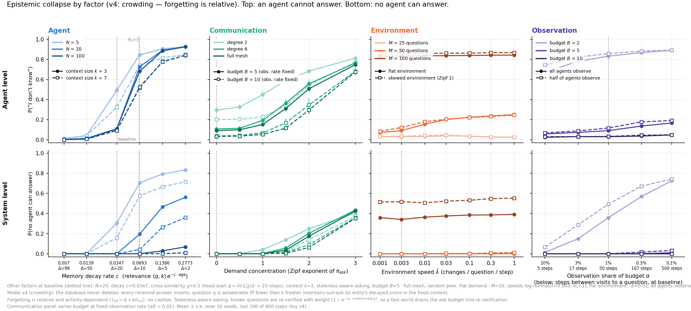

# Epistemic collapse in multi-agent systems — model v4 and the collapse-by-factor figure

Helivan × Calcifer Computing. Follow-on to *Control Charts for Multi-agent Systems*
(arXiv:2605.11135). This README documents the current simulator (`toy_v4.py`) and the
main figure. Everything here reproduces in ~3 minutes on a multicore machine with
numpy + matplotlib; no other dependencies, no data files.



## 1. The question

N agents each hold a retrieval database, answer questions by retrieving into a finite
context, exchange answers with peers, and say "I don't know" (IDK) when retrieval
provides no grounding. The world keeps changing under them. **Epistemic collapse** is
the regime in which an agent (agent level) or every agent (system level) can answer
with nothing but IDK. The figure asks: which factors carry a healthy system to
collapse, at which level, and how sharply?

## 2. The model (`toy_v4.py`)

**Agent / retrieval.** Each agent is a grounded responder over an infinite database.
An entry's retrieval relevance is

> ⟨q, k⟩ · e^(−c · (t − t\*)) , with **t\* = the time the entry was inserted** into
> this agent's database (receipt clock — re-hearing an answer refreshes relevance).

The exact-match entry has ⟨q,k⟩ = 1; entries for other questions have cross-similarity
χ < 1. Retrieval puts the top **k_ctx** entries into the context; the agent answers q
iff its q-entry makes the context, else IDK. Nothing is ever deleted, so **forgetting
is relative (crowding), not absolute**: the q-entry is outranked by a cross-question
entry only if that entry is more than Δ = ln(1/χ)/c steps fresher, and it takes k_ctx
such entries to push it out. The effective memory lifetime is therefore

> τ_eff ≈ Δ + k_ctx / r_ins ,  Δ = ln(1/χ)/c ,

where r_ins is the agent's insertion rate — **every received answer and every
observation inserts** (and crowds). Forgetting is activity-dependent: quiet agents'
old memories resurface.

**Communication.** Fixed contact graph. Each step every agent takes B actions; each
action is an environment observation with probability α, otherwise an ask. For each
ask the agent draws a question (with replacement) and a random neighbour; the peer
answers iff its own entry is retrievable. Questions are drawn from a **shared** Zipf
demand π_ask (exponent s_ask; one global popularity ranking — correlated attention).
The default asking policy is **staleness-aware**: a known question is re-asked with
weight (1 − e^(−λ_q · evidence age))², i.e. agents re-verify at the rate they expect
the world to change. On receiving a duplicate, the copy with the **newer evidence
(t_obs) wins** the per-question slot; the database state updates **once per
iteration** (all reads during step t see the end-of-(t−1) state).

**Environment.** M questions; the true answer of question q is an integer counter
that increments with probability λ_q per step (geometric inter-change times, mean
1/λ_q). Per-question speeds are log-normal around λ̄ with dispersion σ_λ = 1 (a
`frac_static` option pins a subset at λ = 0). Observation returns the exact current
truth, stamped with t_obs. π_env (exponent s_env) sets which questions the
environment reveals when observed.

**There is no caution rule.** An agent with a retrievable entry always answers; a
fast environment makes answers *stale*, not absent. Provenance t_obs travels
unchanged through exchange and is used only to score answers correct vs. stale.

**Metrics** (mean over last 200 of 800 steps, 10 seeds): `idk` = 1 − mean(answerable)
over (agent, question) pairs; `dead_q` = fraction of questions no agent can answer;
`correct` / `stale` = split of given answers against current truth; `sys_corr` =
fraction of questions some agent answers correctly.

## 3. Baseline

All panels hold the other factors at:

| | |
|---|---|
| agents | N = 20, decay c = 0.0347, χ = 0.5 (⇒ Δ = 20 steps), context k_ctx = 3 |
| communication | budget B = 5, full mesh, random peer, flat demand (s_ask = 0), staleness-aware asking |
| environment | M = 50, speeds log-normal(λ̄ = 0.003, σ_λ = 1), flat π_env |
| observation | α = 0.01 (1 % of budget; each question revisited ≈ every 50 steps), all agents observe |

This puts R₀ = (1−α)B·τ_eff/M ≈ 2 (healthy, above the SIS threshold R₀ = 1) with the
clocks ordered Δ (20) < revisit interval (50) ≪ validity 1/λ̄ (333). Baseline
readings: **idk 0.090, stale 0.164, correct 0.746, dead 0.000** (dotted vertical in
every panel).

## 4. Reading the figure (`figure1_v4_collapse_by_factor.png`)

**Rows.** Top: agent-level P(IDK) — a random (agent, question) pair cannot be
answered. Bottom: system-level P(no agent can answer) — the question is dead
everywhere. **Encoding, identical in every column**: hue = factor; lightness = the
factor's second variable (light → dark = small → large); solid-filled vs.
dashed-hollow = its third variable; grey dotted vertical = the common baseline; grey
dashed vertical = mean-field R₀ = 1 where the x-variable maps onto R₀. Mean ± s.e.,
10 seeds.

**Column 1 — Agent (blue). x = memory decay rate c** (tick sub-labels give
Δ = ln(1/χ)/c). Second variable N ∈ {5, 20, 100}; third variable context size
k_ctx ∈ {3, 7}. Availability collapses as a sharp threshold almost exactly at
R₀ = 1 (idk 0.09 → 0.7–0.9 between Δ = 20 and Δ = 10), N-invariant at the agent
level. At the system level N matters strongly (N = 100 barely dies even at the
fastest decay — more agents means a larger resurfacing reservoir and more
observations), and the larger context k = 7 buys meaningful system-level protection.

**Column 2 — Communication (green). x = demand concentration** (Zipf exponent of the
shared π_ask). Second variable edge density: degree 2 / 6 / full mesh; third variable
budget B ∈ {5, 10} at **fixed observation rate** (α scaled so αB = 0.05 — the
bandwidth effect isolated from observation). Concentrated demand kills the
un-asked-about tail at both levels (mesh: idk 0.10 → 0.8 across s = 0 → 3). Degree 6
is already as good as the mesh; degree 2 pays a roughly constant tax. Doubling the
budget roughly halves agent-level IDK at every density and delays system death.

**Column 3 — Environment (orange). x = mean speed λ̄** (changes/question/step, up to
1). Second variable world size M ∈ {25, 50, 100}; third variable π_env skew (flat
vs. Zipf 1). Two separate mechanisms are visible: (i) **dilution** — M = 100 halves
R₀ and sits collapsed at every speed (idk ≈ 0.84, dead 0.35, 0.50 under skew), while
M = 25 is immune; (ii) **re-verification drain** — at M = 50 speed converts into IDK
through the staleness-aware policy (0.06 → 0.25), saturating once every known
question always looks stale (λ̄ ≳ 0.1). Speed hurts systems with moderate slack;
without the staleness-aware policy this column's top row would be exactly flat
(availability dynamics are otherwise λ-independent — speed then acts only through
staleness, visible in the not-correct companion `fig_factors_v4_notcorrect.png`).

**Column 4 — Observation (purple). x = share of budget spent observing, α** (10 % →
0.1 %, scarcity increasing rightward; tick sub-labels give the per-question revisit
interval M/(αBN) at baseline). Second variable total budget B ∈ {2, 5, 10}; third
variable observer fraction (all vs. half of agents). B = 2 sits below the bandwidth
threshold (R₀ < 1): the system dies as observation is withdrawn and the environment
channel is all that holds it up. B ≥ 5 never dies at the system level — circulation
alone sustains availability — but agent-level IDK still climbs with scarcity because
aging evidence triggers ever more re-verification (same drain as column 3).

**The one-sentence summary.** Availability is governed by R₀ = bandwidth ×
memory-lifetime / world-size plus demand concentration; correctness is governed by
environment speed and observation rate; the decay rate and the staleness-aware
re-verification policy are the couplings that let each factor reach both.

## 5. Reproducing

```bash
cd experiments/collapse
python3 run_factors_v4.py     # 1,380 runs, ~2 min on 30 cores -> factor_v4_results.json
python3 plot_factors_v4.py    # -> figure1_v4_collapse_by_factor.png + idk/notcorrect/system companions
```

`toy_v4.run()` is a single numpy function; every figure variable is a keyword
argument. Switches useful for ablation: `sigma="unknown_first"` (removes the
staleness-aware coupling; environment and observation columns then flatten in IDK),
`answer_policy="firsthand"` (no-miming grounding), `frac_static`, `mean_degree`,
`peer="freshest"`.

## 6. Files in scope

| file | role |
|---|---|
| `toy_v4.py` | the simulator (current model; docstring = spec) |
| `run_factors_v4.py` | baseline dict + the four factor grids → `factor_v4_results.json` |
| `plot_factors_v4.py` | renders the 2×4 figure and the three 1×4 metric companions |
| `figure1_v4_collapse_by_factor.png` | **the figure** |
| `fig_factors_v4_{idk,system,notcorrect}.png` | the two rows separately + the not-correct metric |

Everything else in this directory (v1–v3 simulators, E0, policy/attention-war/
self-limiting figures, `epistemic_collapse_experiment_design.md`, `notes/`) is
earlier iterations and supplementary material; the design doc still describes the
v2-era caution model and is pending revision.
