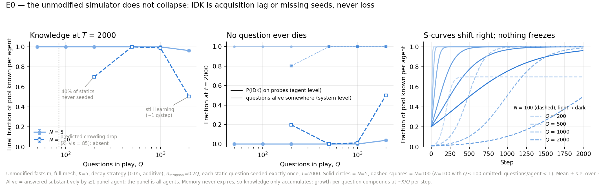

# E0 — Collapse in the unmodified code: results

Run 2026-09-08. 300 cells: Q ∈ {50, 100, 200, 500, 1000, 2000} × N ∈ {5, 100} × 30 seeds
(N=100 with Q ≤ 100 dropped: questions_per_agent < 1), K = 5, decay forgetting (0.05, additive),
n_temporal = 0.2Q, each static question seeded exactly once, T = 2000, full mesh. Unmodified
fastsim; synthetic QA parquet (only the strings are used). ~15 min wall-clock on 30 cores.
Reproduce: `gen_e0.py` → `run_cell.py` per config (xargs) → `plot_e0.py`.

## Headline: the prediction was wrong — the unmodified simulator does not collapse

The design doc predicted a sharp drop in acquired knowledge around Q ≈ K·SAME_Q_VISIBILITY ≈
100–200. There is none. Final knowledge per agent (fraction of pool):

| N \ Q | 50 | 100 | 200 | 500 | 1000 | 2000 |
|---|---|---|---|---|---|---|
| 5 | 1.00 | 1.00 | 1.00 | 1.00 | 1.00 | 0.96 |
| 100 | — | — | 0.70* | 1.00 | 0.99 | 0.51† |

\* seeding artifact † truncated S-curve — both explained below. Alive fraction = 1.00 in every
cell except *, where it equals the seeded fraction from t = 0.

## Why: without expiry, growth always compounds

In fastsim IDK ⇔ never-learned (occupancy is only ever incremented; `core.py:333`). With every
question seeded and no death term, per-question copies grow at ≈ K·X/Q per step — an epidemic
with R₀ = ∞. Any Q yields a logistic S-curve; larger Q only stretches the timescale (e-fold time
≈ Q/K steps: Q = 500 saturates by t ≈ 700 at N = 100; Q = 2000 reaches 50% at t = 2000 and is
still accelerating at ~0.9 questions/step). The `gen_configs.py` claim that Q = 8N + 10 "freezes"
the mesh is a **timescale illusion**: at N = 10⁴, Q ≈ 8·10⁴ the e-fold time is ~16k steps, so a
2k-step run looks frozen; it is not an equilibrium.

The two nonzero IDK readings at T = 2000 decompose exactly:

- **N = 100, Q = 200**: `questions_per_agent` = floor(0.8·200/100) = 1 → 100 seeded slots < 160
  static questions → 37.5% of statics dead from t = 0. Agents know *everything that exists*
  (idk_static = 1 − alive_static to 3 decimals). Pure seeding shortfall, not dynamics.
- **N = 100, Q = 2000**: mid-epidemic (mean_known 20 → 214 → 999 over the run). Longer T would
  reach 1.0.

## Consequences for the programme

1. **E1 is necessary, not optional.** Epistemic collapse as a persistent state cannot occur in
   the unmodified code at any (K, Q); it requires extension (a), the absolute expiry τ_mem.
   Everything the SIS model predicts (threshold at R₀ = K·τ_mem/Q, extinction) is contingent on
   adding a death term. E0 establishes the null: no death term → no threshold.
2. **The crowding question moves entirely to the LLM arm.** Fastsim cannot show post-learning
   IDK by construction; whether retrieval crowding produces it in the real system (Section 3 of
   the design doc) is only testable with the LLM path. E0-LLM (3 seeds, N = 5, Q ∈ {50, 200,
   500}) is specified but blocked on a live OPENAI_API_KEY.
3. **Seeding audit belongs in every config generator**: require N × questions_per_agent ≥ static
   count, or dead-from-birth questions contaminate A(∞). (E1's `questions_per_agent: Q/N` rule
   hits the same floor at Q < N.)
4. Practical notes for E1–E5: one fastsim cell (N = 100, Q = 2000, T = 2000) ≈ 2 min, small cells
   ≈ 1–2 s; the probe panel scales as 0.4Q questions — the `run_cell.py` condense-and-delete
   wrapper keeps 300 cells at ~10 MB total. The probe-snapshot route recovers alive/IDK exactly
   when the panel includes all agents.

